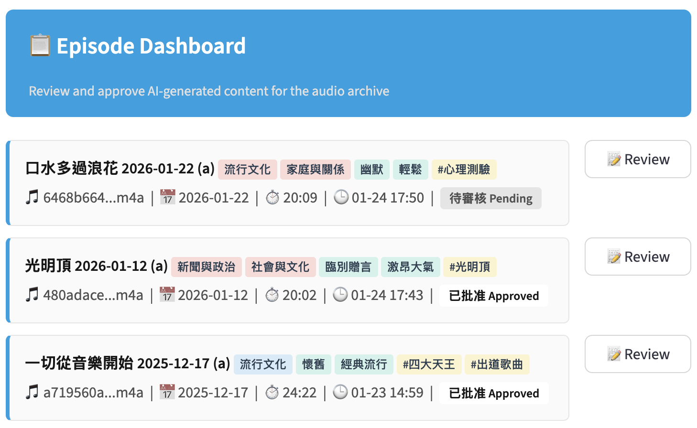
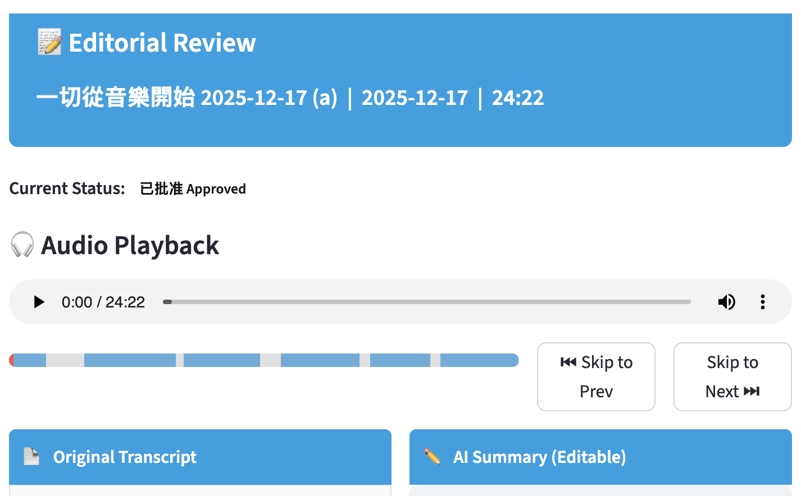

# Radio Show Editorial Review Demo

A "fan-made" AI-Powered LLM-based editorial tool to process and review radio show archive. It uses Google's Gemini models (multimodal) to transcribe audio, detect music segments, and generate structured metadata (summaries, hashtags, categories).

## Get Started (快速開始)

1. **Install dependencies**:
   ```bash
   pip install -r requirements.txt
   ```
2. **Set API Key**:
   ```bash
   export GEMINI_API_KEY="your_gemini_api_key"
   ```
3. **Run the app**:
   ```bash
   streamlit run app.py
   ```

## Features

### 1. AI Processing Pipeline

- **Direct Upload**: Audio files (m4a) are uploaded directly to Gemini's multimodal context window.
- **Smart Transcription**:
  - Distinguishes spoken content from music.
  - Extracts music segments with timestamps (`[MUSIC PLAYING: start - end]`).
  - Generate AI summary and identifies tone and vibe tags.
- **Configurable Prompts**: Driven by `prompts.toml` to iterate without code changes.

### 2. Editorial Dashboard

- **Status Workflow**: Track episodes through `Pending` → `Approved` / `Rejected`.
- **Toast Notifications**: Custom persistent notification queue for user feedback.
- **Statistics**: Real-time metrics on repository status.

### 3. Review Interface

- **Audio Player**: with a visualized music timeline and a “Jump to next song” button.
- **Dual-Column View**: Read-only transcript (left) vs. Editable summary (right).
- **Tagging System**: Multi-select UI for Categories, Tags, Tone, and Vibe.

### 4. Comparison Tools

- **Diff Viewer**: Visual highlights of changes between original AI generation and editorial edits.
- **Baseline Comparison**: Compare current summaries against historical baselines (via CLI flag `--base`).

### Technical Stack

- **Frontend**: Streamlit (Python)
- **AI Engine**: Google Gemini (Multimodal) GenAI SDK (`gemini-3-pro-preview`)
- **Datastore**: JSON file (`data/episodes.json`)
- **Audio Handling**: `mutagen` (metadata), Gemini File API
- **Prompt Engineering**: Externalized `prompts.toml`

### Common Issues

**1. Missing Dependencies**
- Ensure you are running Python 3.11+ and have installed all packages: `pip install -r requirements.txt`.

**2. Audio Upload Failures**
- Ensure `GEMINI_API_KEY` is set correctly and has permissions for the Gemini File API.

**3. API Rate Limits (429 Errors)**
- Check your Google Cloud project quotas for the model you’re using (e.g., `gemini-3-pro-preview`).

## Screenshots



